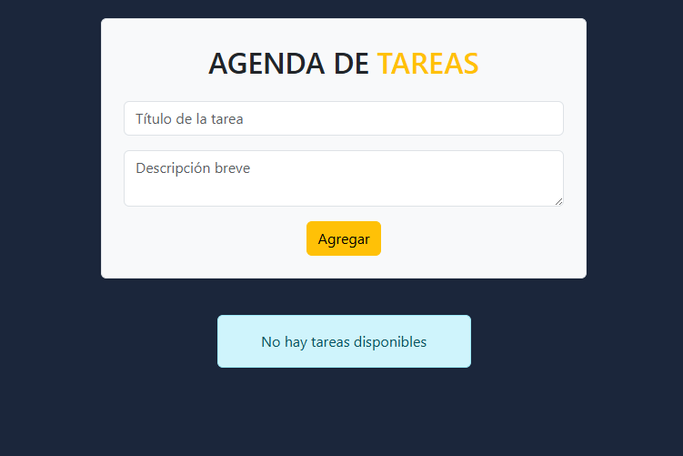

# 📝 PersonalTask - Lista de Tareas con React y Node.js

Una aplicación full stack para gestionar tus tareas de forma simple y eficiente.

## 🚀 Tecnologías Utilizadas

- **Frontend:** React + Vite + React Bootstrap + Axios + SweetAlert2
- **Backend:** Node.js + Express
- **Gestión de estado:** React Context API
- **Estilos:** React Bootstrap + custom styling

## 🖥️ Cómo ejecutar el proyecto

-El proyecto consta de dos carpetas, donde encontrarás el backend y frontend del mismo.
-dentro del BACKEND debes ejecutar:
 --npm install
 --nodemon (para inicializar el backend que esta alojado en localhost:3000)

-Abre otra terminal:
-Dentro del FRONTEND:
 --npm install
 --npm run dev para inicializar el proyecto.

## 📸 Vista previa

